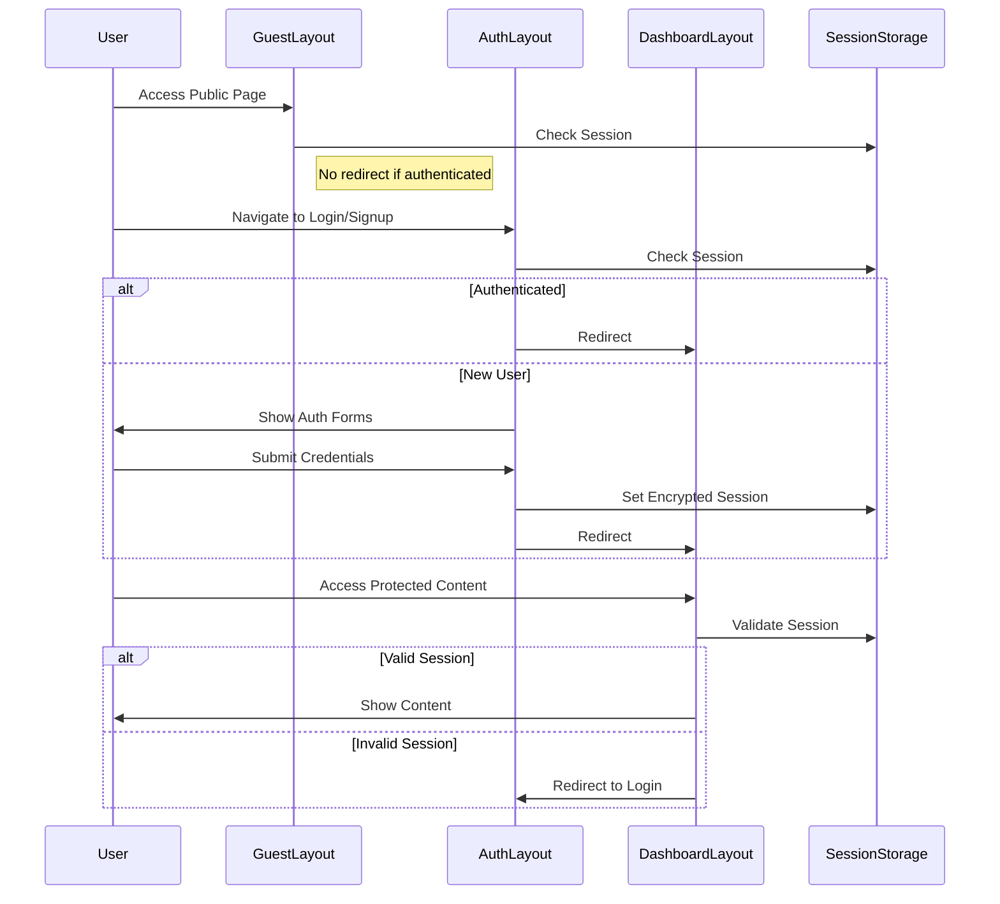
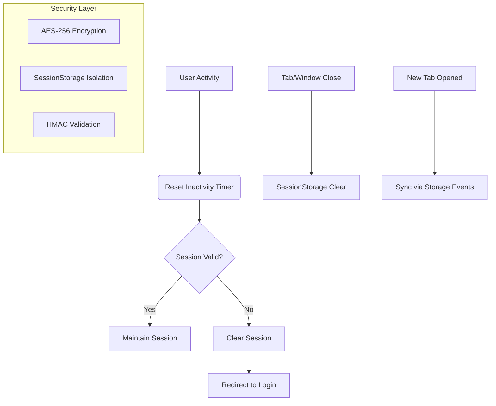
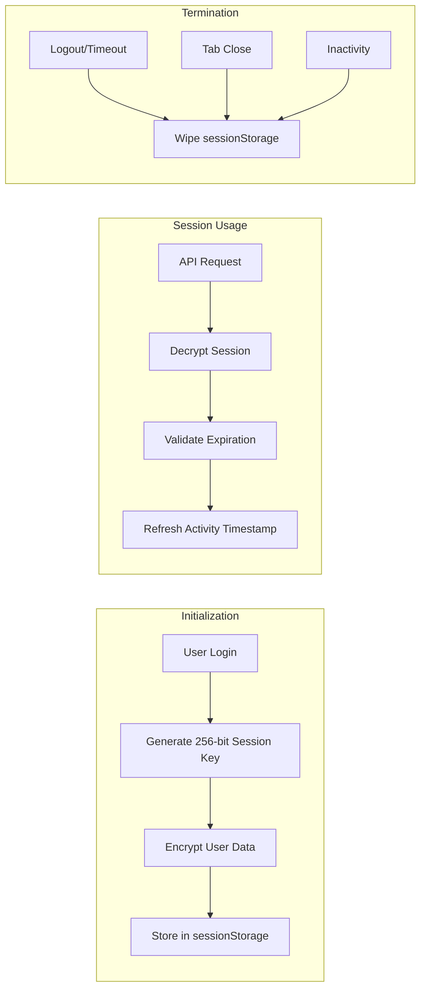

# Strimz Payroll Integration Suite

Secure DeFi payroll management with automated crypto disbursements and enterprise-grade session management.

## Features

- 🔐 AES-256-CBC Session Encryption
- ⏳ Configurable Session Timeouts
- 🛡️ Cross-Tab Session Synchronization
- 📊 Activity-Based Session Renewal
- 🔄 Seamless Crypto Payment Automation

## Authentication Flow

## Session Management Architecture

## Encryption Workflow

## Key Security Features

1. **Session Storage**
   - Tab-specific isolation
   - Automatic clearance on tab close
   - Encrypted payload storage

2. **Cryptographic Protections**
   - AES-256-CBC encryption
   - PBKDF2 key derivation (1000 iterations)
   - Unique IV per session

3. **Activity Monitoring**
   - 15-minute inactivity timeout
   - Mouse/keyboard/scroll detection
   - Periodic session validation

4. **Cross-Tab Security**
   - Storage event synchronization
   - Session replication prevention
   - Focus state validation
