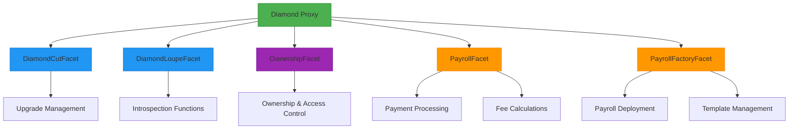
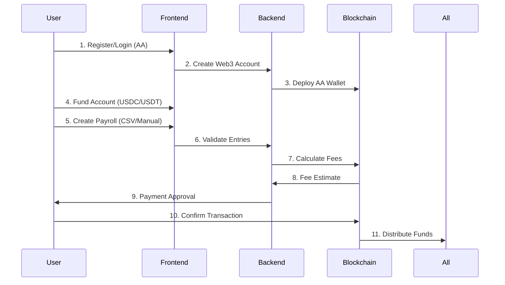

# Strimz Payroll - Web3 Native Payroll Automation

[](https://strimz-payroll.vercel.app)


**Enterprise-grade DeFi payroll solution with automated crypto disbursements and seamless web2 onboarding**

> "Financial operations reimagined for the blockchain era"

## 🌟 Features

### Core Capabilities

- 🧑💻 **Web2-style UX** with Web3 power (Account Abstraction powered)
- 💸 **Crypto(stablecoins) payroll** (USDC/USDT on Celo)
- 📦 **Diamond Standard Proxy** for seamless contract upgrades
- 📈 **Progressive fee structure** (Pay-per-use model)
- 🔄 **Bulk payment processing** (CSV or manual entry)
- ⚡ **Gas-optimized transactions**

## 🛠 Tech Stack

| Layer                | Technologies                                                                 |
|----------------------|------------------------------------------------------------------------------|
| **Frontend**         | Next.js 14, TypeScript, Wagmi, Shadcn UI, Radix UI                           |
| **Backend**          | Node.js, Express, PostgreSQL, Redis (Session Management)                     |
| **Blockchain**       | Celo, USDC/USDT Token Standards                                      |
| **Smart Contracts**  | Solidity 0.8.20, Diamond Standard (ERC-2535), Foundry, OpenZeppelin          |

## 📦 Contract Architecture



## 💸 Fee Structure Model

**Mathematical Model:**

```math
Total Fee = Base Fee (0.30 USD) + Variable Fee (0.15 × √N)
```

**Example Calculations:**

| Addresses | Calculation         | Total Fee |
|-----------|---------------------|-----------|
| 1         | 0.30 + (0.15 × 1)   | $0.45     |
| 5         | 0.30 + (0.15 × 2.24)| $0.64     |
| 20        | 0.30 + (0.15 × 4.47)| $0.97     |
| 100       | 0.30 + (0.15 × 10)  | $1.80     |

*Economies of scale: 2× addresses = ~40% fee increase*

## 🔗 Smart Contract Verification

- **Diamond Proxy:** [0xF61F...b7ae](https://louper.dev/diamond/0xf61f16ec212c7d7fd08c0776d0429477a235b7ae?network=baseSepolia)
- **USDC Contract:** Celo Network
- **USDT Contract:** Celo Network

## 🌐 API Documentation

[](https://documenter.getpostman.com/view/17877618/2sAYQZGrQc#intro)

## 🔄 Workflow Process



## 🙏 Acknowledgements

- **Celo Network** for EVM-optimized infrastructure
- **OpenZeppelin** for battle-tested contract libraries
- **EIP-2535** Diamond Standard community
- **AA Community** for account abstraction pioneers
